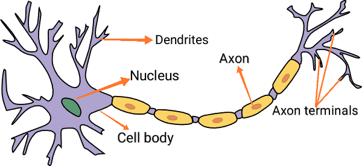
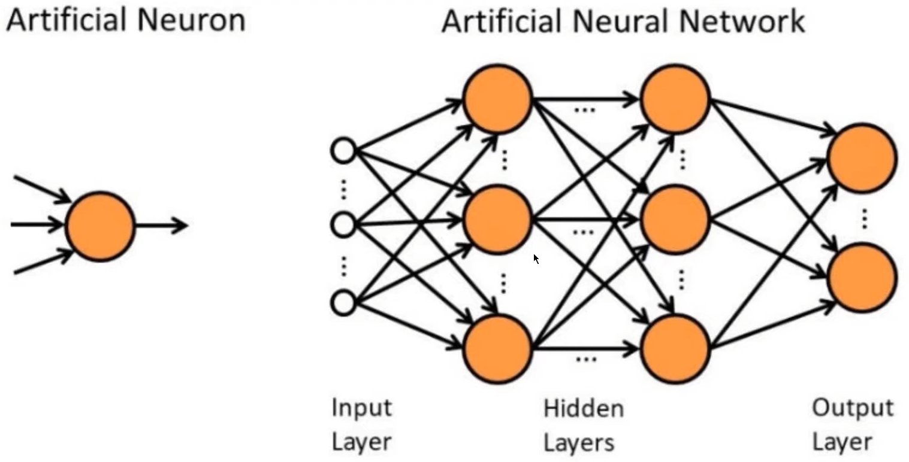

# AI-Python_Study
중요, 확인
>참고 링크:https://www.youtube.com/watch?v=C1P7PaIeKvU&list=PL7ZVZgsnLwEEIC4-KQIchiPda_EjxX61r&index=2

>참고 링크:https://youtu.be/0r_QueHF3Qg

------------------------------------------------------------------------------------------------------------------------------------------------------------------------------------------------------------------------------------------------------------
###  2023년 4월 3일 인공지능 스터디

파이토치 버전 확인
~~~
import torch
print(torch.__version__)
~~~
>2.0.0+cu118

초기화 되지 않은 행렬 
~~~
x = torch.empty(4, 2)
print(x)
~~~
>tensor([[1.7878e+23, 9.2906e-43],
        [1.7878e+23, 9.2906e-43],
        [1.7889e+23, 9.2906e-43],
        [1.7889e+23, 9.2906e-43]])

 
무작위로 초기화된 행렬(텐서)
~~~
x = torch.rand(4, 2)
print(x)
~~~
>tensor([[0.8871, 0.3499],
        [0.3245, 0.5496],
        [0.2350, 0.4584],
        [0.7282, 0.1444]])

dtype dl long, 0으로 채워진 텐서
~~~
x = torch.zeros(4, 2, dtype=torch.long)
print(x)
~~~
>tensor([[0, 0],
        [0, 0],
        [0, 0],
        [0, 0]])

------------------------------------------------------------------------------------------------------------------------------------------------------------------------------------------------------------------------------------------------------------
###  2023년 4월 4일 인공지능 스터디

<h4>대표적인 프레임워크</h4>

***1. 텐서플로우(TensorFlow 2.X 버전)***

 - Google, 핵심코드가 C++로 작성
 - 직관적인 고수준 API
 - 뛰어난 이식성 및 확장성, 즉 다양한 플랫폼으로 확장하여 활용 가능
 </t> - Tensorflow-Lite, TensorFlow Extened

 - 진입장벽이 다소 높음

***2. 케라스(Keras)***
 - 직관적이고 쉬운 API
 - TensorFlow의 백엔드(Backend)활용
 - 동일한 코드로 CPU, GPU에서 실행 가능

***3. 파이토치(PyTorch)***
 - Facebook
 - C/CUDA Backend 사용
 - 진입장벽이 낮음. 파이썬 문법과 유사
 - GPU 가속연산

 사용 규모를 봤을 때, 현재는 텐서플로우, 파이토치 둘 다를 아는 것이 가장 좋아 보임
 
<h4>활용 분야</h4>

1. Image & Speech Recognition
2. Medical Diagnosis
3. Statistical Arbitarge

<h4>신경망</h4>(Neural Network)
 

 - 인공지능 분야에서 쓰이는 알고리즘
 - ***'인간의 뇌 구조를 모방'*** (뉴런과 뉴런 사이에는 전기신호를 통해 정보를 전달)
 

<h6>구조를 단순화하여 모델링한 구조</h6>

 - 입력(inputs)과 가중치(weights)를 곱한 선형구조(linear)
 - 활성화 함수(activation function)를 통한 비선형 구조(non-linear) 표현 가능

 

<h4>인공뉴련 VS 인공 신경망</h4>

### 인공 뉴런(Artificial Neuron)
 - 노드(Node)와 엣지(Edge)로 표현
 * 하나의 노드안에서 입력(Inputs)와 가중치(Weights)를 곱하고 더하는 선형(Linear)계산
 * 활성화 함수(Activation Function) 통과를 모두 포함

 - 인공 신경망(Artificial Neural Network)
 * 여러 개의 인공뉴런들이 모여 연결된 형태
 * 뉴런들이 모인 하나의 단위를 층(Layer)이라고 하고, 여러 층(Layer)으로 이루어질 수 있음
 * ex) 입력층(Input Layer), 은닉층(Hidden Layer), 출력층(Output Layer)
 

### 완전 연결 계층(Fully-connected Layer)

 - ***모든 노드들이 서로 연결*** </b>된 신경망
 - Dense Layer라고도 불림
 - 아래 그림에서
 - 입력 노드 3개 - 은닉층1 노드 4개 - 은닉층2 노드 4개 - 출력층 노드 1개 

총 3 * 4 * 4 * 1 = 48개의 선으로 연결

### 신경망의 활용

<h4>회귀(Regression)</h4>

 - 잡음(Noise)을 포함한 학습 데이터로부터 어떤 <U>규칙을 찾고 연속된 값의 출력을 추정</U>
 - 아래의 식을 만족하는 적절한 a(기울기), b(y절편)를 찾아야함

<h6>Y = aX + b</h6>
(X:입력, Y:출력, a:기울기, b:y절편)
 

### 분류(Classification)

 - 입력값에 따라 특정 범주(category)로 구분하는 문제 <U>분류 곡선(직선)</U>을 찾아야 함
 - 범주의 개수에 따라서 이진 분류(Binary Classification), 로지스틱 회귀(Logistic Regression), 선형회귀와 비슷하지만, ***범주형 데이터를*** 분류하는 방향으로 선을 그음(면접점수, 실기점수, 필기점수에 따른 시험 합격 여부)
 - ***다중 분류(Multi_class Classification)***
 - 꽃잎 모양, 색깔에 따른 꽃의 종 분류
 
이미지 출처: https://wikidocs.net/164363, https://www.researchgate.net/figure/Graphical-representation-of-a-single-neuron-and-an-artificial-neural-network_fig6_326005988, https://cs231n.github.io/convolutional-networks/